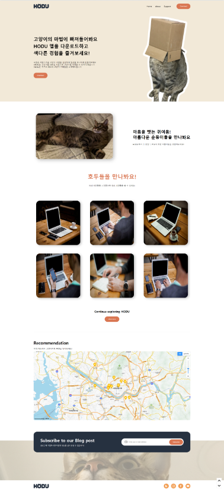
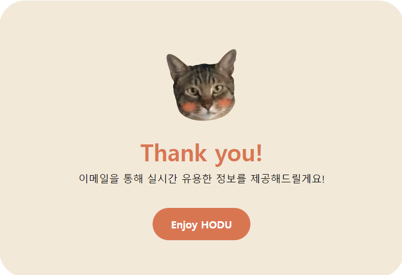
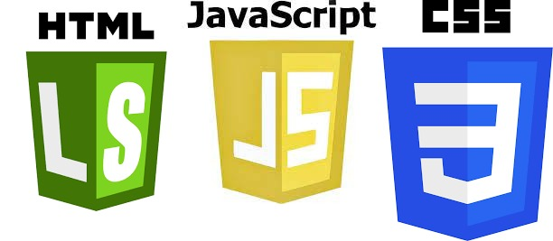
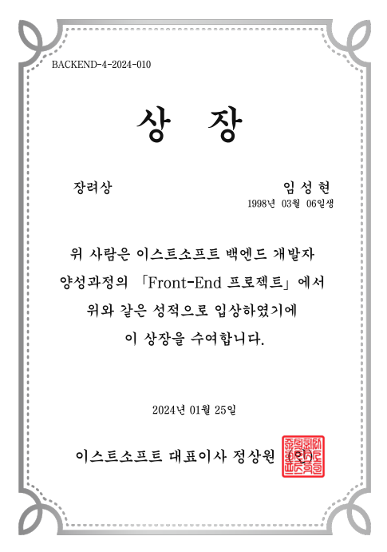

# HODU `Front-end` 프로젝트

> [페이지 배포 주소](https://shlim0287.github.io/frontproject/)

## 목차

1. [소개](#-소개)
2. [디렉토리 구조](#디렉토리-구조)
3. [서비스 화면](#-서비스-화면)
4. [주요 기능](#-주요-기능)
5. [기술 스택](#-기술-스택)
6. [후기](#후기)

<br>

## 🌙 소개

#### 오르미 4기 첫 번째 프론트 프로젝트
주어진 디자인을 활용해 고양이 관련 정보 제공 웹 사이트로 컨셉 지정

<br>

#### 프로젝트 진행 기간
2024-01-15 ~ 2024-01-23

<br>

## 디렉토리 구조
```
├── README.md
├── css
│   ├── style.css
│   └── reset.css
│
├── img
│
│
└── js
│    ├── script.js
│    ├── kakaomap.js
│    └── image-scroll.js
│
└── index.html
```

<br>

## 🖥 서비스 화면

### 메인 화면



### 모달 화면



<br>

## 🔥 주요 기능

- 무한 이미지 스크롤
  - show more 버튼 클릭 시 이미지 무한 로딩
  - Throttle 개념 적용해 이미지 로드 성능 개선 노력
- 카카오 맵 api
  - 맵 안에 수도권 추천 고양이 카페 마크 등록
  - 마크 클릭 시 인포 윈도우를 통해 확인 가능
  - 마크 상세 정보 클릭 시 관련 정보 담긴 url주소로 이동
- 블로그 구독 기능
  - 이메일 입력 후 올바른 값이면 모달창 오픈
  - 잘못된 값 입력 시 css효과로 경고
- 페이지 상하 이동 버튼
  - 일정 높이 이하러 내려가면 버튼 시각화
  - 페이지 상하부 이동 기능


<br>

## 🛠 기술 스택


<br>


## 후기
구현 과정에서 어려움은 많았지만 과정 속에서 얻어가는 부분이 많았던 프로젝트이다
<br>
시맨틱하게 코드를 구성하고자 했으나 아직은 상황별 적절한 코드 배치에 미숙한 것 같다
<br>
추후 추가적인 리팩토링을 통해 사용성을 증가 시킬 예정이다

## 결과



